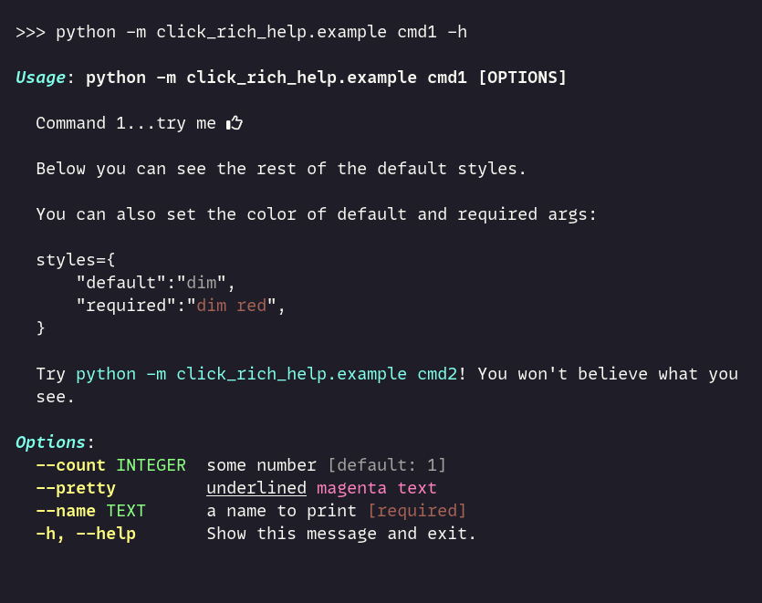
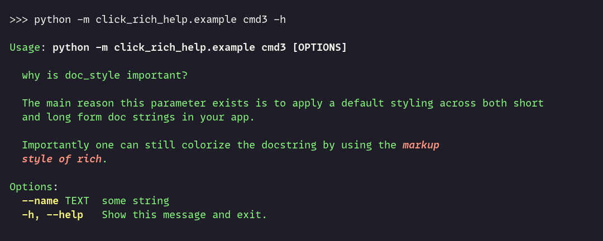
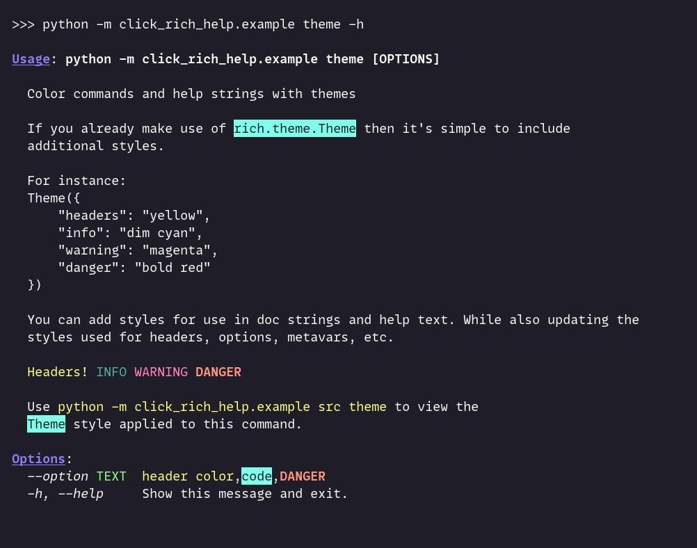
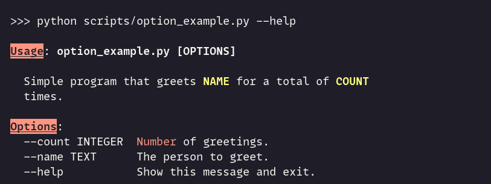
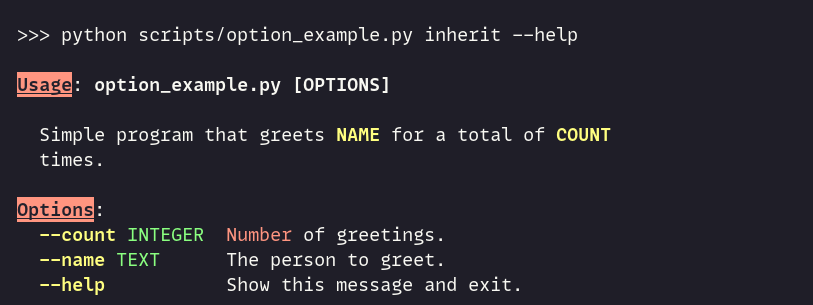
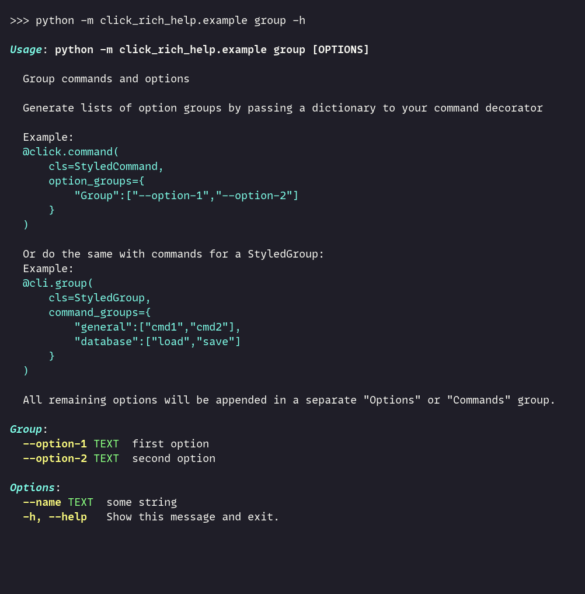

# Usage

## Styles
You have several options for defining your own style.
You can pass a dictionary containing the key value pairs for styles you want included.
`Click-rich-help` defines the following base style which will be applied when no other arguments are provided to the helper classes.

```python
{
  "header": "bold italic cyan",
  "option": "bold yellow",
  "metavar": "green",
  "default": "dim",
  "required": "dim red",
}
```

Additionally, with `python -m click_rich_help.example cmd1 -h` you can see the remaining default theme styles in action.



One additional `click_rich_help` specific style is `doc_style` which can be used to apply styling across long and short docstrings.



## Theme

You can also provide a `rich.theme.Theme` and define the style itself in a separate file:

`default.ini`:
````ini
[styles]
headers="green"
options="yellow"
metavar="red"
````

```python
@click.group(
    cls=StyledGroup,
    theme=Theme.read("default.ini")
)
def cli():
    pass
```

Style options are parsed by `styles` before `theme`. So you may define both depending on your needs.

Any styles passed to the helper classes will be accessible and can be applied using `rich` markup syntax



## Default Theme

If you define any styles and wish to apply them on top of the default style you can pass `"use_theme=default"`

```python
@click.command(cls=StyledCommand,
  styles={
    "header": "bold red underline reverse"
  }
)
@click.option("--count", default=1, help="[red]Number[/red] of greetings.")
@click.option("--name", prompt="Your name", help="The person to greet.")
def hello(count, name):
    """Simple program that greets [b yellow]NAME[/b yellow] for a total of [b yellow]COUNT[/b yellow] times."""
    for _ in range(count):
        click.echo(f"Hello {name}!")
```

Without `use_theme="default"`:



With `use_theme="default"`:



## Grouping Options/Commands

You may also pass `command_groups` or `option_groups` to the helper classes in order to organize help output.



Currently options are matched against long options. Use `--output` not `-o`. When defining your grouping dictionary.
